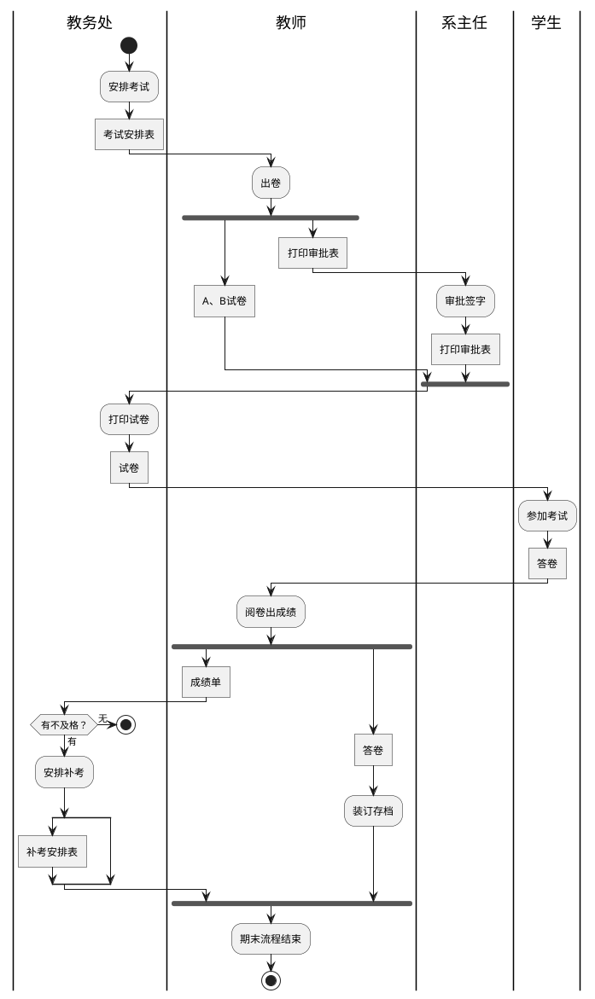
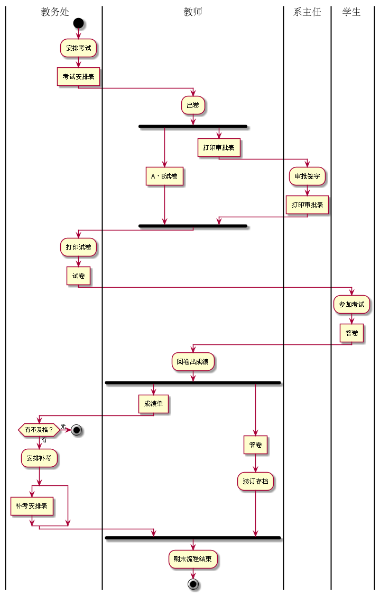
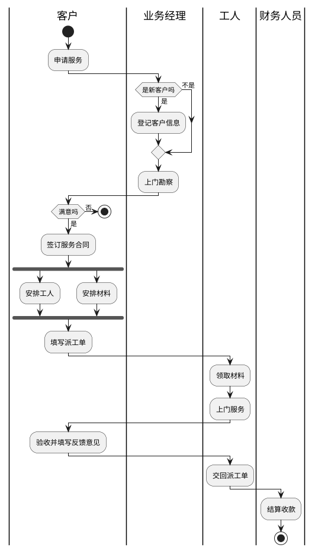
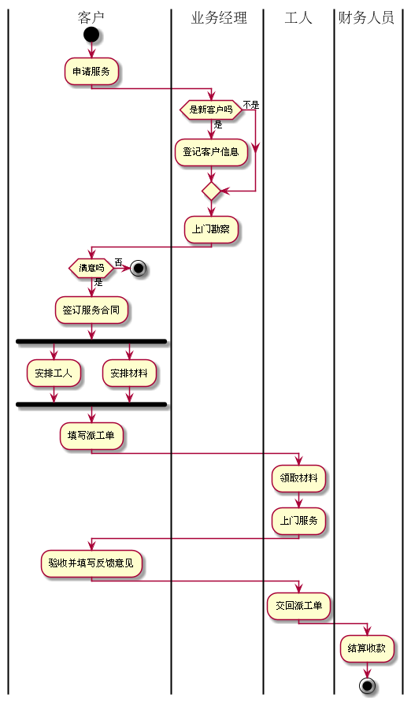

# 实验1:业务流程建模

|学号|班级|姓名|
|----|------|----|
|201610414112|软件（本）16-1|唐银浩|

#### 流程图1：考试及成绩管理流程

* **PlantUML源码如下:**

* **业务流程图如下:**

流程从教务处开始，然后经过教师出卷和系主任打印审批表后，
学生开始考试，当学生考试完后教师阅卷出成绩，
如果有不及格的教务处安排补考，然后发放成绩单，
最后期末流程结束。

#### 流程图2：客户维修服务流程

* **PlantUML源码如下:**

* **业务流程图如下:**

首先客户申请服务，然后业务经理判断是否是新客户，制定方案，
客户是否满意，若满意就开始安排工人和材料，再填写派工单，
工人再进行上门服务，客户填写反馈意见并交回派工单，最后财务人员再进行结算收款，结束。