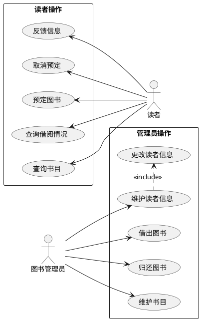
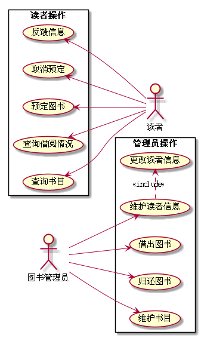

# 实验1:业务流程建模

|学号|班级|姓名|
|----|------|----|
|201610414112|软件（本）16-1|唐银浩|

### 1.图书管理系统用例图
* **PlantUML源码如下:**

* **用例图:**

 

### 2.用例规约表

* **反馈信息:**

    [反馈信息](./markdown/usercase1.md)
    
* **取消预约:** 

    [取消预约](./markdown/usercase2.md)
    
* **预定图书:** 

    [取消预约](./markdown/usercase3.md)