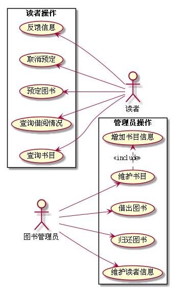

# 实验2:图书管理系统用例建模

|学号|班级|姓名|
|----|------|----|
|201610414112|软件（本）16-1|唐银浩|

## 1.图书管理系统用例图
* **PlantUML源码如下:**

* **用例图:**

 

## 2.参与者说明

#### 2.1图书管理员
主要职责是维护及管理图书，并负责图书的外借与归还。

#### 2.2读者
主要职责是查看自己的借阅情况，搜索图书并预定借书。

 

## 3.用例规约表

#### 【读者规约表】

* **反馈信息规约表:**

    [反馈信息](./markdown/usercase1.md)
    
* **取消约定规约表:** 

    [取消约定](./markdown/usercase2.md)
    
* **预定图书规约表:** 

    [预定图书](./markdown/usercase3.md)
    
* **查询借阅情况规约表:** 
    
    [查询借阅情况](./markdown/usercase4.md)
        
* **查询书目规约表:** 
    
    [查询书目](./markdown/usercase5.md)
    
    
    
#### 【图书管理员规约表】
        
* **增加图书信息规约表:** 
    
    [增加图书信息](./markdown/usercase6.md)
        
* **维护书目规约表:** 
    
    [维护书目](./markdown/usercase7.md)
        
* **借出图书规约表:** 
    
    [借出图书](./markdown/usercase8.md)
        
* **归还图书规约表:** 
    
    [归还图书](./markdown/usercase9.md)
            
* **维护读者信息规约表:** 
    
    [维护读者信息](./markdown/usercase10.md)