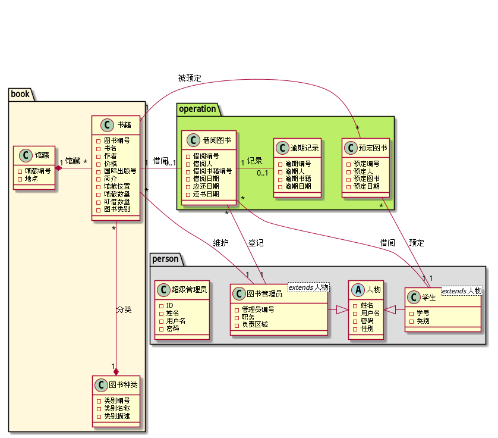

# 实验2:图书管理系统用例建模

|学号|班级|姓名|
|----|------|----|
|201610414112|软件（本）16-1|唐银浩|
## 1.图书管理系统类图
### 1.1PlantUML源码如下:

 

### 1.2类图如下:

 

### 1.3类图说明:
* 学生类与图书管理员类均**继承于抽象类人物**。
* 超级管理员为独立的类，可以对整体数据进行操作。
* 学生与预定图书的关系为**学生预定图书**，且**一对多**。
* 学生与借阅图书的关系为**学生借阅图书**，且**一对零或一**。
* 图书管理员与借阅图书的关系为**管理员登记借阅图书**，且**一对多**。
* 图书管理员与书籍的关系为**管路员维护书籍**，且**一对多**。