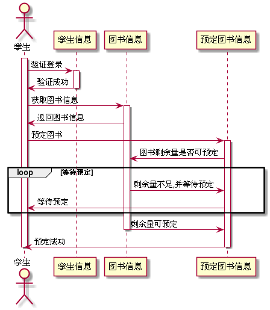

# 实验4:图书管理系统顺序图绘制

|学号|班级|姓名|
|----|------|----|
|201610414112|软件（本）16-1|唐银浩|

## 图书管理系统的顺序图
 

## 1.反馈信息用例
### 1.1反馈信息PlantUML源码

### 1.2反馈信息顺序图

### 1.3反馈信息顺序图说明
学生填写反馈信息表存到数据库，系统返回反馈成功。数据库后台将反馈信息发给图书管理员。

 

## 2.预定图书用例
### 2.1预定图书PlantUML源码

### 2.2预定图书顺序图

### 2.3预定图书顺序图说明
学生登录系统后查询图书信息，然后选择图书进行预定，
系统将查询图书剩余量是否可预定，如果剩余量不足将进行预定等待。
 
直到系统查询到剩余量满足可预定，系统才将图书信息存到预定图书信息表，然后反馈预定成功。

 

## 3.取消预定用例
### 3.1取消预定PlantUML源码

### 3.2取消预定顺序图

### 3.3取消预定顺序图说明
学生登录系统后查询预定的图书信息，选择需要预定的图书信息发给系统，系统将自动
增加图书剩余量，并告知学生取消成功。

 

## 4.查询借阅情况用例
### 4.1查询借阅情况PlantUML源码

### 4.2查询借阅情况顺序图

### 4.3查询借阅情况顺序图说明
学生登录系统后向系统发出查询借阅信息的申请，系统从数据库中返回借阅信息。

 

## 5.查询书目用例
### 5.1查询书目PlantUML源码

### 5.2查询书目顺序图

### 5.3查询书目顺序图说明
学生选择查询方式，然后输入查询内容，系统给读者返回书目信息。

 

## 6.维护书目用例
### 6.1维护书目PlantUML源码

### 6.2维护书目顺序图

### 6.3维护书目顺序图说明
管理员登录系统后选择需要进行的功能，然后根据功能进行不同的操作。

 

## 7.借出书目用例
### 7.1借出书目PlantUML源码

### 7.2借出书目顺序图

### 7.3借出书目顺序图说明
管理员登录系统后首先验证学生信息，然后查阅学生的预定信息，如果学生有预定信息则确认借阅。
 
确认借阅后，系统将修改预定信息为已借阅，同时创建借阅记录表，然后将确认减少图书的馆藏量
（图书显示已预定的人数和剩余可借阅量,如果可借阅数大于已预定的人数则不能预约此书，同时预订人
需要在两日内借阅图书，否则将清除预定信息），并更改当前学生的可借阅书目数量，最后返回借阅结果。

