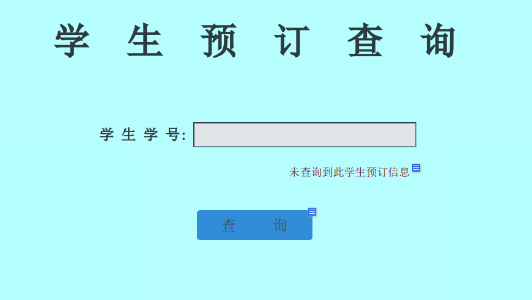
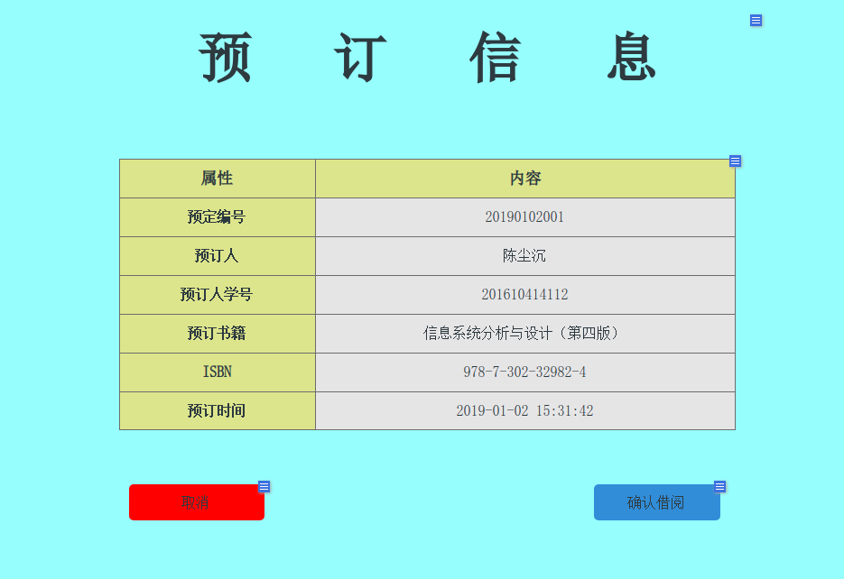
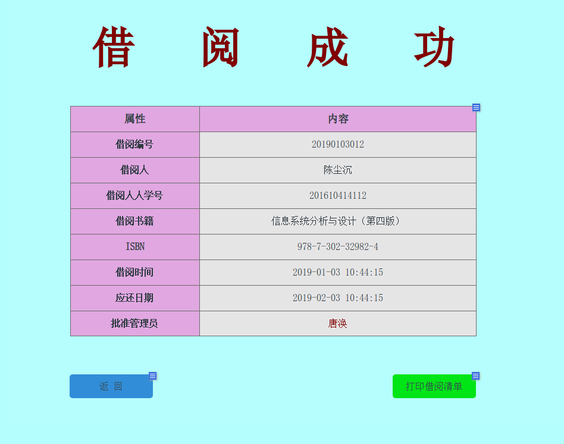

# 实验5:图书管理系统数据库设计与界面设计

|学号|班级|姓名|
|----|------|----|
|201610414112|软件（本）16-1|唐银浩|

## 1.数据库表设计
### 1.1馆藏表(collect)
|  字段   |     类型     | 主键，外键 | 可以为空 | 默认值 | 约束 |   说明   |
| :-----: | :----------: | :--------: | :------: | :----: | :--: | :------: |
|   id    |     bigint   |    主键    |    否    |  自增  |      | 馆藏编号 |
| address | varchar(150) |            |    否    |   ""   |      | 馆藏地点 |
<br>

### 1.2图书表(book)
|     字段     |     类型     | 主键，外键 | 可以为空 | 默认值 |    约束    |    说明    |
| :----------: | :----------: | :--------: | :------: | :----: | :--------: | :--------: |
|   book_id    |    bigint    |    主键    |    否    |  自增  |            |  图书编号  |
|  book_name   | varchar(150) |            |    否    |   ""   |            |    书名    |
|    author    | varchar(150) |            |    否    |   ""   |            |    作者    |
|    pirce     |    float     |            |    否    |  0.0   |            |    价格    |
|     ISBN     | varchar(150) |            |    否    |   ""   |            | 国际出版号 |
|    detail    | varchar(255) |            |    是    |   ""   |            |    简介    |
| collect_add  |    bigint    |    外键    |    否    |    0   | collect.id |  馆藏位置  |
| collect_num  |    bigint    |            |    否    |   0    |            |  馆藏数量  |
| borrowed_num |    bigint    |            |    否    |   0    |            |  可借数量  |
|  book_kind   |    bigint    |    外键    |    否    |    0   |  kind.id   |  图书类别  |
<br>

### 1.3图书种类表(kind)
|   字段    |     类型     | 主键，外键 | 可以为空 | 默认值 | 约束 |   说明   |
| :-------: | :----------: | :--------: | :------: | :----: | :--: | :------: |
|    id     |    bigint    |    主键    |    否    |  自增  |      | 类别编号 |
| kind_name | varchar(150) |            |    否    |   ""   |      | 类别名称 |
|  detail   | varchar(150) |            |    是    |   ""   |      | 类别描述 |
<br>

### 1.4超级管理员表(admin)
|   字段   |     类型     | 主键，外键 | 可以为空 | 默认值 | 约束 |   说明   |
| :------: | :----------: | :--------: | :------: | :----: | :--: | :------: |
|    id    |    bigint    |    主键    |    否    |  自增  |      | 管理员id |
|   name   | varchar(150) |            |    否    |   ""   |      |   姓名   |
| username | varchar(150) |            |    否    |   ""   |      |  用户名  |
| password | varchar(30)  |            |    否    |   ""   |      |   密码   |
<br>

### 1.5图书管理员表(manager)
|   字段   |     类型     | 主键，外键 | 可以为空 | 默认值 | 约束 |     说明     |
| :------: | :----------: | :--------: | :------: | :----: | :--: | :----------: |
|    id    |    bigint    |    主键    |    否    |  自增  |      | 图书管理员id |
|   name   | varchar(150) |            |    否    |   ""   |      |     姓名     |
| username | varchar(150) |            |    否    |   ""   |      |    用户名    |
| password | varchar(30)  |            |    否    |   ""   |      |     密码     |
|  gender  |  varchar(5)  |            |    否    |   ""   |      |     性别     |
|   job    | varchar(50)  |            |    是    |   ""   |      |     职务     |
|   area   |    bigint    |            |    否    |   0    |      |   负责区域   |
<br>

### 1.6管理区域表(manager_area)
|    字段     |  类型  | 主键，外键 | 可以为空 | 默认值 |    约束    |     说明     |
| :---------: | :----: | :--------: | :------: | :----: | :--------: | :----------: |
|     id      | bigint |    主键    |    否    |  自增  |            |  区域管理id  |
| collect_add | bigint |    外键    |    否    |        | collect.id | 馆藏区域地址 |
| manager_id  | bigint |    外键    |    否    |        | manager.id |   管理员id   |
<br>

### 1.7学生表(student)
|   字段   |     类型     | 主键，外键 | 可以为空 | 默认值 | 约束 |   说明   |
| :------: | :----------: | :--------: | :------: | :----: | :--: | :------: |
|    id    |    bigint    |    主键    |    否    |  自增  |      | 学生学号 |
|   name   | varchar(150) |            |    否    |   ""   |      |   姓名   |
| username | varchar(150) |            |    否    |   ""   |      |  用户名  |
| password | varchar(30)  |            |    否    |   ""   |      |   密码   |
|  gender  |  varchar(5)  |            |    否    |   ""   |      |   性别   |
|   kind   | varchar(50)  |            |    是    |   ""   |      |   类别   |
<br>

### 1.8预定图书表(order)
|    字段    |   类型   | 主键，外键 | 可以为空 | 默认值 |     约束     |   说明   |
| :--------: | :------: | :--------: | :------: | :----: | :----------: | :------: |
|  order_id  |  bigint  |    主键    |    否    |  自增  |              | 预定编号 |
| order_name |  bigint  |    外键    |    否    |        |  student.id  | 预定学生 |
|  book_id   |  bigint  |    外键    |    否    |        | book.book_id | 预定图书 |
| order_date | datetime |            |    否    |        |              | 预定时间 |
<br>

### 1.9借阅图书表(borrow)
|    字段     |   类型   | 主键，外键 | 可以为空 | 默认值 |     约束     |     说明     |
| :---------: | :------: | :--------: | :------: | :----: | :----------: | :----------: |
|  borrow_id  |  bigint  |    主键    |    否    |  自增  |              |   借阅编号   |
| borrow_stu  |  bigint  |    外键    |    否    |        |  student.id  |  借阅人学号  |
|   book_id   |  bigint  |    外键    |    否    |        | book.book_id | 借阅图书编号 |
| borrow_date | datetime |            |    否    |        |              |   借阅时间   |
| return_date | datetime |            |    否    |        |              |   应还时间   |
| revert_date | datetime |            |    是    |        |              | 实际归还时间 |
<br>

### 1.10逾期记录表(overdue)
|     字段     |   类型   | 主键，外键 | 可以为空 | 默认值 |     约束     |     说明     |
| :----------: | :------: | :--------: | :------: | :----: | :----------: | :----------: |
|  overdue_id  |  bigint  |    主键    |    否    |  自增  |              |   逾期编号   |
| overdue_stu  |  bigint  |    外键    |    否    |        |  student.id  |  逾期人学号  |
|   book_id    |  bigint  |    外键    |    否    |        | book.book_id | 逾期图书编号 |
| overdue_date | datetime |            |    否    |        |              |   逾期时间   |
<br>

## 2.界面设计
* 界面地址：https://tyh97.github.io/is_analysis_pages/
### 2.1借阅图书界面
* 页面一

* 页面二

* 页面三

* 用例图参见：[借阅图书用例](../test2/markdown/usercase8.md)
* 用例流程参见：[借阅图书流程](../test4/picture/borrowBook.png)
* 类图参见：[借阅图书类](../test3/picture/libraryManager.png)，
[预定图书类](../test3/picture/libraryManager.png)，
[学生类](../test3/picture/libraryManager.png)，
[图书管理员类](../test3/picture/libraryManager.png)

<br>

### 2.2API接口
#### 2.2.1查询学生预定信息
* 功能：用于查询学生的预定图书信息
* 地址：https://tyh97.github.io/is_analysis_pages/v1/api/select_stu_orderInfo
* 请求方式：GET
* 请求参数说明：

|   参数名称   | 必填 |              说明              |
| :----------: | :--: | :----------------------------: |
| access_token |  是  | 用于验证请求合法性的认证信息。 |
|  student_id  |  是  |    用于查询学生的预定信息。    |
|    method    |  是  |         固定为 “GET”。         |
* 请求实例：
https://tyh97.github.io/is_analysis_pages/v1/api/select_stu_orderInfo?access_token=15478562&student_id=201610414112&method=GET
* 返回参数说明：

| 参数名称 |            说明            |
| :------: | :------------------------: |
|  result  | 返回学生预定信息是否存在。 |
|   data   |       学生预定信息。       |
|   code   |        查询状态码。        |
* 返回实例：
```json
{
  "result": "success",
  "data": {
    "order_id": "20190102001",
    "student": "陈尘沉",
    "stu_id": "201610414112",
    "book_name": "信息系统分析与设计（第四版）",
    "ISBN": "978-7-302-32982-4",
    "order_date": "2019-01-02 15:31:42"
  },
  "code": "200"
}
```
#### 2.2.1生成图书借阅清单
* 功能：管理员确认借阅，并生成图书借阅清单
* 地址：https://tyh97.github.io/is_analysis_pages/v1/api/confirm_borrow
* 请求方式：PATCH
* 请求参数说明：

|   参数名称   | 必填 |              说明              |
| :----------: | :--: | :----------------------------: |
| access_token |  是  | 用于验证请求合法性的认证信息。 |
|  student_id  |  是  |   用于确认借阅图书的学生编号   |
|   order_id   |  是  |   用于确认借阅图书的预定编号   |
|  manager_id  |  是  |  用于确认借阅图书的管理员编号  |
|    method    |  是  |        固定为 “PATCH”。        |

* 请求实例：
```json
{
  "access_token": "15478562",
  "student_id":"201610414112",
  "order_id": "20190102001",
  "manager_id": "201421453211",
  "method": "PATCH"
}
```
* 返回参数说明：

| 参数名称 |        说明        |
| :------: | :----------------: |
|  result  | 返回学生借阅结果。 |
|   data   |   图书借阅清单。   |
|   code   |    操作状态码。    |

* 返回实例：
```json
{
  "result": "success",
  "data": {
    "borrow_id": "20190103012",
    "student": "陈尘沉",
    "stu_id": "201610414112",
    "book_name": "信息系统分析与设计（第四版）",
    "ISBN": "978-7-302-32982-4",
    "borrow_date": "2019-01-02 15:31:42",
    "return_date": "2019-02-03 10:44:15",
    "manager": "唐涣"
  },
  "code": "200"
}
```