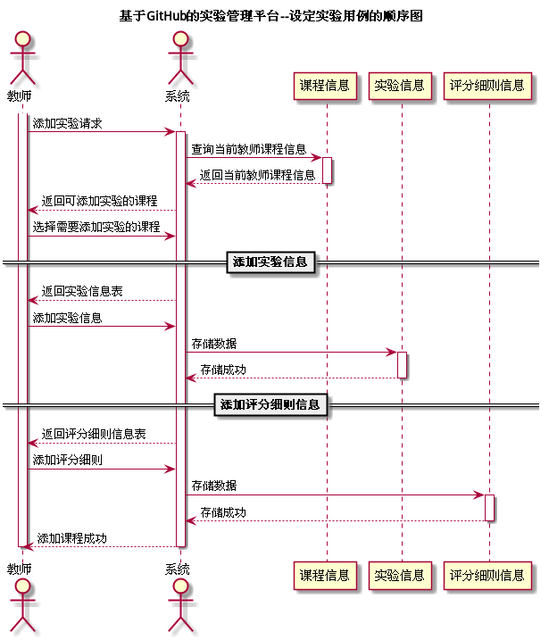

# "设定实验"用例 | [返回](../README.md#6)

## 1.用例规约

<table >
    <tr>
        <td width="150"> <b>&nbsp;用例名称</b></td>
        <td colspan="2" width="700">&nbsp;设定实验</td>
    </tr>
    <tr>
        <td width="150"> <b>&nbsp;参与者</b></td>
        <td colspan="2" width="700">&nbsp;教师</td>
    </tr>
    <tr>
        <td width="150"> <b>&nbsp;前置条件</b></td>
        <td colspan="2" width="700">&nbsp;教师添加课程</td>
    </tr>
    <tr>
        <td width="150"> <b>&nbsp;后置条件</b></td>
        <td colspan="2" width="700">&nbsp;学生选课</td>
    </tr>
    <tr>
        <td colspan="3" width="200"> <b>&nbsp;主事件流</b></td>
    </tr>
    <tr>
        <td colspan="2" width="180"> <b>&nbsp;参与者动作</b></td>
        <td width="410"> <b>&nbsp;系统行为</b></td>
    </tr>
    <tr>
        <td colspan="2" width="180">
            &nbsp;1.教师选择添加实验；
             
            &nbsp;
             
            &nbsp;3.教师输入需要添加的实验信息和评分标准及占分比重；
             
            &nbsp;
             
            &nbsp;5.教师确认结果，用例结束；
        </td>
        <td width="480">
            &nbsp;
             
            &nbsp;2.系统返回添加信息表；
             
            &nbsp;
             
            &nbsp;4.系统将信息存至数据库中并反馈添加结果；
             
            &nbsp;
        </td>
    </tr>
    <tr>
        <td colspan="3" width="200"> <b>&nbsp;备选时间流</b></td>
    </tr>
    <tr>
        <td colspan="3" width="200">
            &nbsp;4a.信息添加失败
             
            &nbsp;&emsp;1.提示教师信息添加失败，返回第3步
        </td>
    </tr>
    <tr>
        <td colspan="3" width="200"> <b>&nbsp;业务规则</b></td>
    </tr>
    <tr>
        <td colspan="3" width="200">
            &nbsp;1.教师添加信息后必须验证信息的合法性。
             
            &nbsp;2.教师必须将所有的信息添加完毕后才能让学生进行选课。
        </td>
    </tr>
</table>

 

## 2.业务流程(顺序图) | [源码](../puml/AddTests.puml)

 

## 3.界面设计
* 界面参照:
* API接口调用
    * 接口1:
    
    
 

## 4.算法描述
无

## 5.参照表
* [Course](../Markdown/DataBase.md#course课程表)
* [Teachers](../Markdown/DataBase.md#teachers表教师表)
* [Tests](../Markdown/DataBase.md#Tests实验表)
* [score_rules](../Markdown/DataBase.md#score_rules评分细则表)