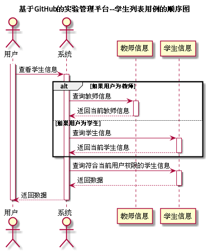

# "学生列表"用例 | [返回](../README.md#6)

## 1.用例规约

<table>
    <tr>
        <td width="150"> <b>&nbsp;用例名称</b></td>
        <td colspan="2" width="700">&nbsp;学生列表</td>
    </tr>
    <tr>
        <td width="150"> <b>&nbsp;参与者</b></td>
        <td colspan="2" width="700">&nbsp;学生及教师</td>
    </tr>
    <tr>
        <td width="150"> <b>&nbsp;前置条件</b></td>
        <td colspan="2" width="700">&nbsp;已在系统登录</td>
    </tr>
    <tr>
        <td width="150"> <b>&nbsp;后置条件</b></td>
        <td colspan="2" width="700">&nbsp;无</td>
    </tr>
    <tr>
        <td colspan="3" width="200"> <b>&nbsp;主事件流</b></td>
    </tr>
    <tr>
        <td colspan="2" width="180"> <b>&nbsp;参与者动作</b></td>
        <td width="410"> <b>&nbsp;系统行为</b></td>
    </tr>
    <tr>
        <td colspan="2" width="180">
            &nbsp;1.用户选择查看学生信息；
             
            &nbsp;
             
            &nbsp;3.用户确认查看学生信息，用例结束；
        </td>
        <td width="480">
            &nbsp;
             
            &nbsp;2.系统获取当前用户信息并返回学生信息；
             
            &nbsp;
        </td>
    </tr>
    <tr>
        <td colspan="3" width="200"> <b>&nbsp;备选时间流</b></td>
    </tr>
    <tr>
        <td colspan="3" width="200">
            &nbsp;2a.用户为学生
             
            &nbsp;&emsp;1.系统返回当前学生所在班级的学生信息
             
            &nbsp;2b.用户为教师
             
            &nbsp;&emsp;1.系统返回教师所教授班级的学生信息
             
            &nbsp;2c.当前用户的信息缺失
             
            &nbsp;&emsp;1.提示用户信息缺失并提示用户添加用户信息
        </td>
    </tr>
    <tr>
        <td colspan="3" width="200"> <b>&nbsp;业务规则</b></td>
    </tr>
    <tr>
        <td colspan="3" width="200">
            &nbsp;1.系统显示学生信息时必须按照当前用户类型进行分类显示。
        </td>
    </tr>
</table>

 

## 2.业务流程(顺序图) | [源码](../puml/AllStudentList.puml)

 

## 3.界面设计
* 界面参照:
* API接口调用
    * 接口1:[getStudentList](../interface/GetStudentListInter.md)
    
    
 

## 4.算法描述
无

## 5.参照表
* [Students](../Markdown/DataBase.md#students学生表)
* [Teachers](../Markdown/DataBase.md#teachers教师表)
