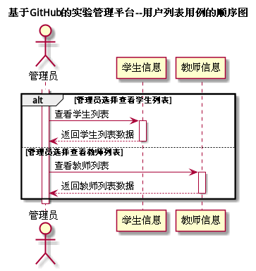

# "用户列表"用例 | [返回](../README.md#6)

## 1.用例规约

<table>
    <tr>
        <td width="150"> <b>&nbsp;用例名称</b></td>
        <td colspan="2" width="700">&nbsp;用户列表</td>
    </tr>
    <tr>
        <td width="150"> <b>&nbsp;参与者</b></td>
        <td colspan="2" width="700">&nbsp;管理员</td>
    </tr>
    <tr>
        <td width="150"> <b>&nbsp;前置条件</b></td>
        <td colspan="2" width="700">&nbsp;已在系统登录</td>
    </tr>
    <tr>
        <td width="150"> <b>&nbsp;后置条件</b></td>
        <td colspan="2" width="700">&nbsp;无</td>
    </tr>
    <tr>
        <td colspan="3" width="200"> <b>&nbsp;主事件流</b></td>
    </tr>
    <tr>
        <td colspan="2" width="180"> <b>&nbsp;参与者动作</b></td>
        <td width="410"> <b>&nbsp;系统行为</b></td>
    </tr>
    <tr>
        <td colspan="2" width="180">
            &nbsp;1.管理员发起查看所有用户信息请求；
             
            &nbsp;2.管理员选择需要查看的角色种类；
             
            &nbsp;
             
            &nbsp;4.管理员确认查看信息，用例结束；
        </td>
        <td width="480">
            &nbsp;
             
            &nbsp;
             
            &nbsp;3.系统按分类返回所选择的角色的所有用户信息；
             
            &nbsp;
        </td>
    </tr>
    <tr>
        <td colspan="3" width="200"> <b>&nbsp;备选时间流</b></td>
    </tr>
    <tr>
        <td colspan="3" width="200">
            &nbsp;3a.所选择的种类无用户信息
             
            &nbsp;&emsp;1.提示管理员无用户信息，返回第2步
        </td>
    </tr>
    <tr>
        <td colspan="3" width="200"> <b>&nbsp;业务规则</b></td>
    </tr>
    <tr>
        <td colspan="3" width="200">
            &nbsp;1.系统按照班级或者职位等分类返回学生或教师的信息。
             
            &nbsp;2.系统必须提供搜索用户的功能，并能够选择多种方式进行搜索。
        </td>
    </tr>
</table>

 

## 2.业务流程(顺序图) | [源码](../puml/AllUserList.puml)
