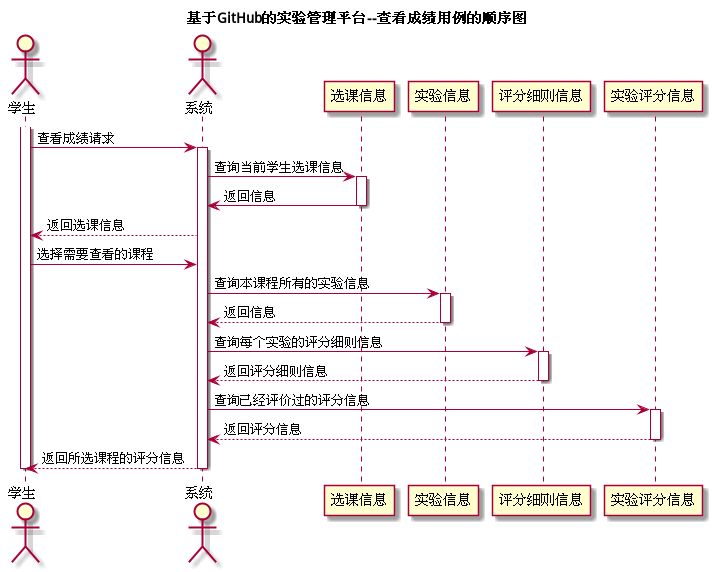

# "查看成绩"用例 | [返回](../README.md#6)

## 1.用例规约

<table>
    <tr>
        <td width="150"> <b>&nbsp;用例名称</b></td>
        <td colspan="2" width="700">&nbsp;查看成绩</td>
    </tr>
    <tr>
        <td width="150"> <b>&nbsp;参与者</b></td>
        <td colspan="2" width="700">&nbsp;学生</td>
    </tr>
    <tr>
        <td width="150"> <b>&nbsp;前置条件</b></td>
        <td colspan="2" width="700">&nbsp;教师评定成绩</td>
    </tr>
    <tr>
        <td width="150"> <b>&nbsp;后置条件</b></td>
        <td colspan="2" width="700">&nbsp;无</td>
    </tr>
    <tr>
        <td colspan="3" width="200"> <b>&nbsp;主事件流</b></td>
    </tr>
    <tr>
        <td colspan="2" width="180"> <b>&nbsp;参与者动作</b></td>
        <td width="410"> <b>&nbsp;系统行为</b></td>
    </tr>
    <tr>
        <td colspan="2" width="180">
            &nbsp;1.学生发起查看评分请求；
             
            &nbsp;
             
            &nbsp;3.学生选择所需要查看的课程；
             
            &nbsp;
             
            &nbsp;5.学生确认分数，用例结束；
        </td>
        <td width="480">
            &nbsp;
             
            &nbsp;2.系统返回本学期该学生所选课程；
             
            &nbsp;
             
            &nbsp;4.系统返回该课程的总分及各项实验的分数和评分细则；
             
            &nbsp;
        </td>
    </tr>
    <tr>
        <td colspan="3" width="200"> <b>&nbsp;备选时间流</b></td>
    </tr>
    <tr>
        <td colspan="3" width="200">
            &nbsp;2a.该学生未选课
             
            &nbsp;&emsp;1.提示学生未选课，返回第1步
             
            &nbsp;4a.暂无评分
             
            &nbsp;&emsp;1.提示学生暂无评分，返回第3步
        </td>
    </tr>
    <tr>
        <td colspan="3" width="200"> <b>&nbsp;业务规则</b></td>
    </tr>
    <tr>
        <td colspan="3" width="200">
            &nbsp;1.学生需要选课之后才能查看本课程的成绩。
             
            &nbsp;2.课程的总分是根据教师的评分及占比实时统计的分数。
        </td>
    </tr>
</table>

 

## 2.业务流程(顺序图) | [源码](../puml/CheckScore.puml)
