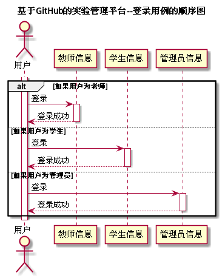

# "登录"用例 | [返回](../README.md#6)

## 1.用例规约

<table>
    <tr>
        <td width="150"> <b>&nbsp;用例名称</b></td>
        <td colspan="2" width="700">&nbsp;登录</td>
    </tr>
    <tr>
        <td width="150"> <b>&nbsp;参与者</b></td>
        <td colspan="2" width="700">&nbsp;所有用户</td>
    </tr>
    <tr>
        <td width="150"> <b>&nbsp;前置条件</b></td>
        <td colspan="2" width="700">&nbsp;无</td>
    </tr>
    <tr>
        <td width="150"> <b>&nbsp;后置条件</b></td>
        <td colspan="2" width="700">&nbsp;进入系统</td>
    </tr>
    <tr>
        <td colspan="3" width="200"> <b>&nbsp;主事件流</b></td>
    </tr>
    <tr>
        <td colspan="2" width="180"> <b>&nbsp;参与者动作</b></td>
        <td width="410"> <b>&nbsp;系统行为</b></td>
    </tr>
    <tr>
        <td colspan="2" width="180">
            &nbsp;1.用户发起登录；
             
            &nbsp;
             
            &nbsp;3.用户进入系统； 
        </td>
        <td width="480">
            &nbsp;
             
            &nbsp;2.系统查询信息是否合法；
             
            &nbsp;
        </td>
    </tr>
    <tr>
        <td colspan="3" width="200"> <b>&nbsp;备选时间流</b></td>
    </tr>
    <tr>
        <td colspan="3" width="200">
            &nbsp;2a.用户密码错误
             
            &nbsp;&emsp;1.提示查询信息，返回第1步
             
            &nbsp;2b.当前角色无此用户
             
            &nbsp;&emsp;1.提示查询信息，返回第1步
        </td>
    </tr>
    <tr>
        <td colspan="3" width="200"> <b>&nbsp;业务规则</b></td>
    </tr>
    <tr>
        <td colspan="3" width="200">
            &nbsp;1.用户在进行登录时选择登录的角色。
             
            &nbsp;2.只有用户登录成功后才能被进入系统。
        </td>
    </tr>
</table>

 

## 2.业务流程(顺序图) | [源码](../puml/LoginInfo.puml)

 

## 3.界面设计
* 界面参照:
* API接口调用
    * 接口1:[login](../interface/LoginInter.md)
    
    
 

## 4.算法描述
无

## 5.参照表
* [Students](../Markdown/DataBase.md#students学生表)
* [Teachers](../Markdown/DataBase.md#teachers教师表)
* [Manager](../Markdown/DataBase.md#manager管理员表)