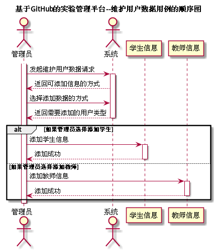

# "维护用户数据"用例 | [返回](../README.md#6)

## 1.用例规约

<table >
    <tr>
        <td width="150"> <b>&nbsp;用例名称</b></td>
        <td colspan="2" width="700">&nbsp;维护用户数据</td>
    </tr>
    <tr>
        <td width="150"> <b>&nbsp;参与者</b></td>
        <td colspan="2" width="700">&nbsp;管理员</td>
    </tr>
    <tr>
        <td width="150"> <b>&nbsp;前置条件</b></td>
        <td colspan="2" width="700">&nbsp;已在系统登录</td>
    </tr>
    <tr>
        <td width="150"> <b>&nbsp;后置条件</b></td>
        <td colspan="2" width="700">&nbsp;无</td>
    </tr>
    <tr>
        <td colspan="3" width="200"> <b>&nbsp;主事件流</b></td>
    </tr>
    <tr>
        <td colspan="2" width="180"> <b>&nbsp;参与者动作</b></td>
        <td width="410"> <b>&nbsp;系统行为</b></td>
    </tr>
    <tr>
        <td colspan="2" width="180">
            &nbsp;1.管理员选择添加用户；
             
            &nbsp;
             
            &nbsp;3.管理员选择添加类型并开始添加信息；
             
            &nbsp;
             
            &nbsp;5.管理员确认添加成功，用例结束；
        </td>
        <td width="480">
            &nbsp;
             
            &nbsp;2.系统返回可添加的信息的类型；
             
            &nbsp;
             
            &nbsp;4.系统接受信息并加入到数据库，并反馈添加结果；
             
            &nbsp;
        </td>
    </tr>
    <tr>
        <td colspan="3" width="200"> <b>&nbsp;备选时间流</b></td>
    </tr>
    <tr>
        <td colspan="3" width="200">
            &nbsp;3a.管理员选择手动添加信息
             
            &nbsp;&emsp;1.系统显示手动添加信息界面
             
            &nbsp;3b.管理员选择通过文件导入信息
             
            &nbsp;&emsp;1.系统显示文件导入界面
             
            &nbsp;4a.系统添加信息失败
             
            &nbsp;&emsp;1.显示错误信息，返回第2步
        </td>
    </tr>
    <tr>
        <td colspan="3" width="200"> <b>&nbsp;业务规则</b></td>
    </tr>
    <tr>
        <td colspan="3" width="200">
            &nbsp;1.管理员选择添加用户信息时，系统应该提供手动添加和文件导入两种类型方式。
             
            &nbsp;2.管理员选择文件导入信息时，系统应该提供多种文件类型供导入。
             
            &nbsp;3.导入失败时数据库应该进行事物回滚，并提示管理员错误信息。
        </td>
    </tr>
</table>

 

## 2.业务流程(顺序图) | [源码](../puml/MaintainUserInfo.puml)
