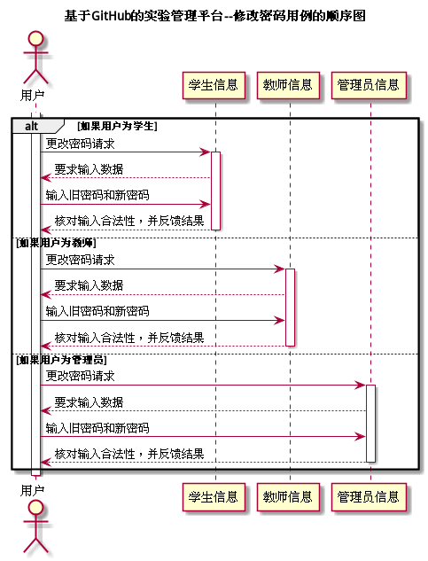

# "修改密码"用例 | [返回](../README.md#6)

## 1.用例规约

<table >
    <tr>
        <td width="150"> <b>&nbsp;用例名称</b></td>
        <td colspan="2" width="700">&nbsp;修改密码</td>
    </tr>
    <tr>
        <td width="150"> <b>&nbsp;参与者</b></td>
        <td colspan="2" width="700">&nbsp;所有用户</td>
    </tr>
    <tr>
        <td width="150"> <b>&nbsp;前置条件</b></td>
        <td colspan="2" width="700">&nbsp;已在系统登录</td>
    </tr>
    <tr>
        <td width="150"> <b>&nbsp;后置条件</b></td>
        <td colspan="2" width="700">&nbsp;无</td>
    </tr>
    <tr>
        <td colspan="3" width="200"> <b>&nbsp;主事件流</b></td>
    </tr>
    <tr>
        <td colspan="2" width="180"> <b>&nbsp;参与者动作</b></td>
        <td width="410"> <b>&nbsp;系统行为</b></td>
    </tr>
    <tr>
        <td colspan="2" width="180">
            &nbsp;1.用户发起更新密码请求；
             
            &nbsp;
             
            &nbsp;3.用户同时输入旧密码和新密码；
             
            &nbsp;
             
            &nbsp;5.用户确认结果，用例结束；
        </td>
        <td width="480">
            &nbsp;
             
            &nbsp;2.系统要求用户同时输入旧密码和新密码；
             
            &nbsp;
             
            &nbsp;4.系统验证旧密码和新密码的合法性，并反馈结果；
             
            &nbsp;
        </td>
    </tr>
    <tr>
        <td colspan="3" width="200"> <b>&nbsp;备选时间流</b></td>
    </tr>
    <tr>
        <td colspan="3" width="200">
            &nbsp;3a.新密码不符合安全要求
             
            &nbsp;&emsp;1.提示用户不符合安全要求，返回第3步
             
            &nbsp;4a.输入的旧密码不正确
             
            &nbsp;&emsp;1.提示用户旧密码不正确，返回第3步
             
            &nbsp;4b.两次新密码不相同
             
            &nbsp;&emsp;1.提示用户两次新密码不相同，返回第3步
             
            &nbsp;4c.新密码不符合安全规范
             
            &nbsp;&emsp;1.提示用户新密码不符合安全规范，返回第3步
        </td>
    </tr>
    <tr>
        <td colspan="3" width="200"> <b>&nbsp;业务规则</b></td>
    </tr>
    <tr>
        <td colspan="3" width="200">
            &nbsp;1.用户必须在输入旧密码正确的前提下才能更新新的密码。
             
            &nbsp;2.用户必须输入两次新密码，且必须一样时才能更新。
             
            &nbsp;3.新密码必须符合安全规范。
             
            &nbsp;4.密码必须采用特殊制加盐MD5加密方式存储。
        </td>
    </tr>
</table>

 

## 2.业务流程(顺序图) | [源码](../puml/ModifyPassword.puml)
