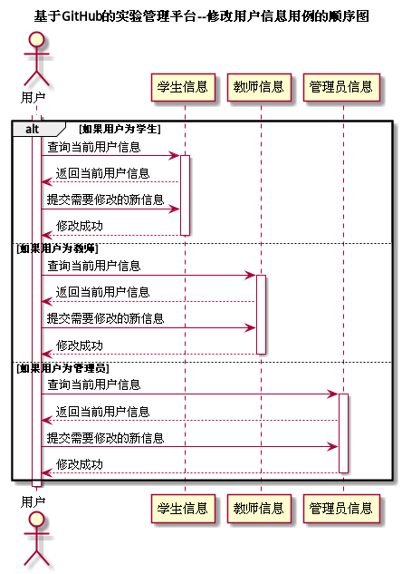

# "修改用户信息"用例 | [返回](../README.md#6)

## 1.用例规约

<table>
    <tr>
        <td width="150"> <b>&nbsp;用例名称</b></td>
        <td colspan="2" width="700">&nbsp;修改用户信息</td>
    </tr>
    <tr>
        <td width="150"> <b>&nbsp;参与者</b></td>
        <td colspan="2" width="700">&nbsp;所有用户</td>
    </tr>
    <tr>
        <td width="150"> <b>&nbsp;前置条件</b></td>
        <td colspan="2" width="700">&nbsp;已在系统登录</td>
    </tr>
    <tr>
        <td width="150"> <b>&nbsp;后置条件</b></td>
        <td colspan="2" width="700">&nbsp;无</td>
    </tr>
    <tr>
        <td colspan="3" width="200"> <b>&nbsp;主事件流</b></td>
    </tr>
    <tr>
        <td colspan="2" width="180"> <b>&nbsp;参与者动作</b></td>
        <td width="410"> <b>&nbsp;系统行为</b></td>
    </tr>
    <tr>
        <td colspan="2" width="180">
            &nbsp;1.用户选择查看用户信息；
             
            &nbsp;
             
            &nbsp;3.用户选择需要修改的信息；
             
            &nbsp;4.用户输入新的信息；
             
            &nbsp;
             
            &nbsp;6.用户确认更改，用例结束；
        </td>
        <td width="480">
            &nbsp;
             
            &nbsp;2.系统查询当前用户信息并返回至页面；
             
            &nbsp;
             
            &nbsp;
             
            &nbsp;5.系统将需要修改的信息保存至数据库，并反馈结果；
             
            &nbsp;
        </td>
    </tr>
    <tr>
        <td colspan="3" width="200"> <b>&nbsp;备选时间流</b></td>
    </tr>
    <tr>
        <td colspan="3" width="200">
            &nbsp;2a.用户信息查询失败
             
            &nbsp;&emsp;1.提示用户查询结果，返回第1步
             
            &nbsp;4a.用户输入的信息不合法
             
            &nbsp;&emsp;1.提示用户信息不合法，返回第3步
             
            &nbsp;5a.更新用户数据失败
             
            &nbsp;&emsp;1.提示用户更新失败，返回第3步
        </td>
    </tr>
    <tr>
        <td colspan="3" width="200"> <b>&nbsp;业务规则</b></td>
    </tr>
    <tr>
        <td colspan="3" width="200">
            &nbsp;1.用户在进行登录后选才能进行修改当前用户的信息。
             
            &nbsp;2.用户输入的信息必须先在前端进行合法验证，合法后才能提交给后台。
             
            &nbsp;3.后台必须验证数据的合法性。
             
            &nbsp;4.系统更新失败时必须提供友好的交互界面。
        </td>
    </tr>
</table>

 

## 2.业务流程(顺序图) | [源码](../puml/ModifyUserInfo.puml)
