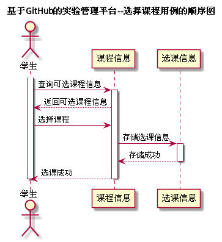

# "选择课程"用例 | [返回](../README.md#6)

## 1.用例规约

<table>
    <tr>
        <td width="150"> <b>&nbsp;用例名称</b></td>
        <td colspan="2" width="700">&nbsp;选择课程</td>
    </tr>
    <tr>
        <td width="150"> <b>&nbsp;参与者</b></td>
        <td colspan="2" width="700">&nbsp;学生</td>
    </tr>
    <tr>
        <td width="150"> <b>&nbsp;前置条件</b></td>
        <td colspan="2" width="700">&nbsp;教师添加课程，学生登录</td>
    </tr>
    <tr>
        <td width="150"> <b>&nbsp;后置条件</b></td>
        <td colspan="2" width="700">&nbsp;无</td>
    </tr>
    <tr>
        <td colspan="3" width="200"> <b>&nbsp;主事件流</b></td>
    </tr>
    <tr>
        <td colspan="2" width="180"> <b>&nbsp;参与者动作</b></td>
        <td width="410"> <b>&nbsp;系统行为</b></td>
    </tr>
    <tr>
        <td colspan="2" width="180">
            &nbsp;1.学生发起选课请求；
             
            &nbsp;
             
            &nbsp;3.学生选择课程；
             
            &nbsp;
             
            &nbsp;5.学生确认结果，用例结束；
        </td>
        <td width="480">
            &nbsp;
             
            &nbsp;2.系统根据班级返回可选择的课程目录；
             
            &nbsp;
             
            &nbsp;4.系统将选课信息存储至数据库，并反馈选课结果；
             
            &nbsp;
        </td>
    </tr>
    <tr>
        <td colspan="3" width="200"> <b>&nbsp;备选时间流</b></td>
    </tr>
    <tr>
        <td colspan="3" width="200">
            &nbsp;2a.学生无可选择课程
             
            &nbsp;&emsp;1.提示学生当前无选择的课程，返回第1步
             
            &nbsp;4a.选课失败
             
            &nbsp;&emsp;1.提示学生选课失败，返回第3步
        </td>
    </tr>
    <tr>
        <td colspan="3" width="200"> <b>&nbsp;业务规则</b></td>
    </tr>
    <tr>
        <td colspan="3" width="200">
            &nbsp;1.学生选课必须根据学生的专业，年级决定。
             
            &nbsp;2.学生选课需要满足一定的条件，例如在选课时间内。
             
            &nbsp;3.学生选课时课程应当注明所有关于本课程的事。
        </td>
    </tr>
</table>

 

## 2.业务流程(顺序图) | [源码](../puml/SelectCourse.puml)

 

## 3.界面设计
* 界面参照:
* API接口调用
    * 接口1:
    
    
 

## 4.算法描述
无

## 5.参照表
* [Students](../Markdown/DataBase.md#students学生表)
* [Course](../Markdown/DataBase.md#course课程表)
* [Select_course](../Markdown/DataBase.md#select_course学生选课表)