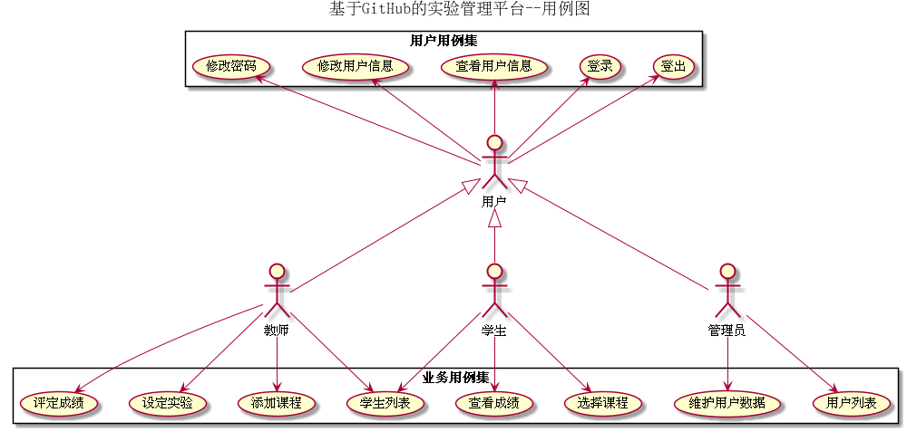

# 实验6:基于GitHub的实验管理平台的分析与设计

|学号|班级|姓名|
|----|------|----|
|201610414112|软件（本）16-1|唐银浩|

## 1.概述
* 基于GitHub的实验管理平台的作用是在线管理实验成绩的Web应用系统。学生和老师的实验内容均存放在GitHUB 页面上。
* 学生的功能主要有：一是设置自己的GitHub用户名；二是查询自己的实验成绩；三是可以选择需要学习的课程；学生的GitHub用户名是公开的，但成绩不公开。
* 老师的功能主要有：一是选择自己需要教学的科目；二是批改每个学生的成绩；三是查看每个学生的成绩。
* 老师和学生都能通过本系统的链接方便地跳转到学生的每个GitHUB实验目录，以便批改实验或者查看实验情况。
* 实验成绩按数字分数计算，老师先制定每个实验的评分细则，然后根据每项评分细则进行评分，最后系统
根据评分细则来进行总分的评定，每项实验的满分为100分，最低为0分。
* 老师首先需要添加自己要教学的课程，可以同时添加多门课程；然后学生根据自己需要选择要上的课程
，一个学生可以同时选择多门课程。

## 2.系统总体结构

 

## 3.用例设计图 [源码](./puml/SystemCase.puml)

 

## 4.类设计图 [源码](./puml/SystemClass.puml)

 

## 5.数据库设计

[参见数据库设计](./Markdown/DataBase.md)

## 6.用例及界面详细设计